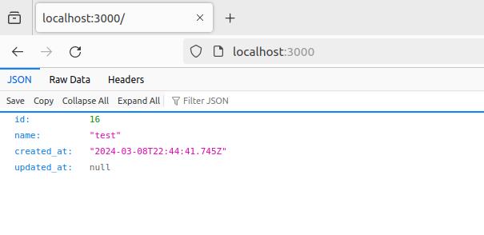

# app-docker-compose-template

Purpose of this project is to offer ready template for dockerized application.
Some key elemets in this template is Node.js application with typescript and automatic build with nodemon.
Data storage is PostgreSQL container with persistent volume for data storage.
Some ready libraries are included for example knex for the database actions.

## Initial preparations

* Install Docker
* Install Docker compose
* Run migrations to latest level if you want that the test api works (see the "Helpful commands" section)

Docker & Docker compose versions that have been tested with this:
```
docker -v
Docker version 24.0.7, build afdd53b

docker compose version
Docker Compose version v2.23.0-desktop.1
```

## How to run

```
docker compose build && docker compose up
```

You can test the initial app by opening your browser and typing in localhost:3000



## Helpful commands
```
// Run psql
docker compose exec app-db psql -h localhost -U postgres

// Run knex init for ts
docker compose exec app knex init -x ts

// Create migration file
docker compose exec -w /usr/src/data app knex migrate:make migration_name -x ts

// Run migrations
docker compose exec -w /usr/src/data app knex migrate:latest
docker compose exec -w /usr/src/data app knex migrate:rollback --all
docker compose exec -w /usr/src/data app knex migrate:up
docker compose exec -w /usr/src/data app knex migrate:down

// Create seed file
docker compose exec -w /usr/src/data app knex seed:make seed_name

// Run seeds
docker compose exec -w /usr/src/data app knex seed:run
```